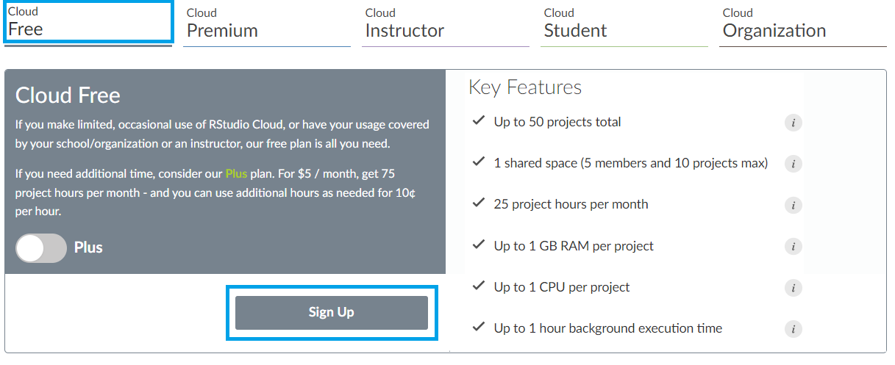

# Primeiros Passos

## Introdução

**R permite que especialistas interpretem, interajam e visualizem dados de forma rápida e fácil**

Antes de inicializar qualquer projeto aplicado através da linguagem computacional R, é importante entender um pouco sobre esta ferramenta, e para isto é necessário destacar que o $\texttt{R}$ é um ambiente para análise de dados. Básicamente é uma linguagem, e pode ser entendida também como um projeto de código aberto, isto é, um projeto cujos códigos estão disponíveis para seu livre descarregamento sem custo nenhum, pemitindo a qualquer pessoa utilizá-los.  

A linguagem $\texttt{R}$ surgiu no começo da década de 90, e foi inicialmente concebida por Robert Gentleman e Ross Ihaka, na época, ambos professores de Departamento de Estatística da Universidade de Auckland, na Nova Zelândia, e especialistas em dados. Desde 1997, o projeto $\texttt{R}$ é gerenciado pelo $\texttt{R}$ Core Group, sendo feito seu primeiro lançamento em fevereiro de 2000. O trabalhos que tiveram o uso intensivo da linguagem envolviam o mapeamento das tendências sociais e de marketing on-line, passando pelo desenvolvimento de modelos financeiros e globando também modelos climáticos para fomentar o desenvolvimento da economia e a sociedade. Assim, muitas das visualizações impactantes de dados e análises estatísticas que são performadas na atualidade por pesquisadores, estatísticos e cientistas de dados podem certamente estarem usando a linguagem $\texttt{R}$ para estes propósitos.


Diversos contribuidores do Core Group continuaram no desenvolvimento e aprimoramento do $\texttt{R}$, dando surgimento a novas ferramentas e aplicativos, acumulando alto volume de pacotes (*package*, no inglês) criadas pelos usuários com o intuito de aprimorar a funcionalidade do $\texttt{R}$ em diversas áreas. A validação da qualidade desses pacotes se dá através de especialistas e líderes reconhecidos em todos os campos, contando com um suporte via crowdsourcing.
Adicionalmente, a linguagem $\texttt{R}$ se destaca por ser interativa, orientada a objetos e funções, onde os objetos podem ser conjuntos de dados, vetores, funções, matrizes etc, e cujas manipulações podem ser cálculos, entradas e saídas de dados, análises estatísticas e gráficos


## Instalando o R

No intuito de auxiliar no processo de download do software, é importante entender que ela é feita $\texttt{R}$ através do CRAN (*Comprehensive R Archive Network*), sendo uma rede de servidores que se encontra distribuída ao redo do mundo, contendo as diversãs e idénticas versões dos códigos e documentações da linguagem de forma atualizada.  

Para fazer download do software, inicialmente selecione a CRAN [`https://cran.r-project.org/`](https://cran.r-project.org/) do seu país e em seguida a cidade  mais próxima a você.

    + Para o caso do Rio de Janeiro, selecione a CRAN Oswaldo Cruz Foundation, Rio de Janeiro, ou acesse [`http://cran.fiocruz.br/`](http://cran.fiocruz.br/)


### Passo a passo da instalação

- Após escolher a CRAN, selecione o link de download compatível com seu sistema operacional, o $\texttt{R}$ se encontra disponível para Linux(Debian, Fedora/Redhat, Ubuntu), macOS e Windows.

- Clique no link 'install R for the first time'.

- Por fim, selecione 'Download R X.X.X for Windows', ou seja, a versão mais atual disponível.


- Uma vez realizado o download, clique duas vezes no arquivo que foi descarregado e siga as instruções da instalação padrão.

- Qualquer dúvida sobre a instalação ou demais, visite a página de perguntas frequentes: [`http://cran.r-project.org/doc/FAQ/R-FAQ.html`](http://cran.r-project.org/doc/FAQ/R-FAQ.html).


Após executar toda a instalação corretamente, o software pode ser acessado
pelo Menu Iniciar (Sistema Windows) ou pelo ícone na sua área de trabalho. Na seguinte Figura está a interface de comando que deverá aparecer quando iniciar o
$\texttt{R}$, 


```{r echo=F, fig.width=4, fig.align='center'}
knitr::include_graphics("R_interface.png", dpi=150)
```


## Instalando o $\texttt{RStudio}$

O $\texttt{RStudio}$ é um ambiente de desenvolvimento integrado (IDE) aberto e *free* para o *software* $\texttt{R}$. Seu principal objetivo é facilitar a integração entre o $\texttt{R}$ e o usuário, sendo uma interface *user-friendly*. O  $\texttt{RStudio}$ é desenvolvido na linguagem de programação C++ e está disponível para diversos sistemas operacionais, tais como: Microsoft Windows, Mac OS X e GNU/Linux. Antes da instalação do $\texttt{RStudio}$ é prioritário ter feito a instalação do $\texttt{R}$.

- 

### Passo a passo para a instalação $\texttt{RStudio}$

- Acesse no site oficial do $\texttt{RStudio}$: http://www.rstudio.org

- Clique no menu *Products* (OPEN SOURCE Get started with R) $\rightarrow$  RStudio

- Descenda na página e selecione RStudio Desktop

- Escolha o link de acordo com o seu sistema operacional

- Instale o programa a partir do arquivo salvo


Uma vez instalado o  software pode ser acessado pelo Menu Iniciar (Sistema Windows) ou pelo ícone na sua área de trabalho tendo o seguinte layout que conta com 4 quadrantes:


```{r echo=F, fig.width=4, fig.align='center'}
knitr::include_graphics("RStudio.png", dpi=150)
```


Esses quadrantes representam o editor, o console, o workspace e o output. O padrão e organização vem nesse formato e ordem, mas você pode ter uma disposição diferente priorizando suas preferências do formato, para isto acesse no menu **Tools** na opção **Global options** na seção do painel esquedo: **Pane Layout**. Os dois principais paineis do $\texttt{RStudio}$ são o **editor** e o **console**.  

1. Editor/Scripts: painel onde são escritos os códigos, o cujo espaço pode ser guardado, sendo aextensão do arquivo ".R"  Assim como o layout pode ser ajustado, as cores do texto dos códigos também podem ser ajustadas facilitando a sua leitura (Siga o caminho: Tools $\rightarrow$ Global optios $\rightarrow$ Appearance).

2. Console: é o painel onde os códigos são rodados e onde também são fornecidas a maioria das saídas.


Os demais painéis são auxiliares. O objetivo deles é facilitar pequenas tarefas que fazem parte tanto da programação quanto da análise de dados, como olhar a documentação de funções, analisar os objetos criados em uma sessão do $\texttt{R}$, procurar e organizar os arquivos que compõem a nossa análise, armazenar e analisar os gráficos criados e muito mais.


- Environment: painel com todos os objetos criados na sessão.
- History: painel com um histórico dos comandos rodados.
- Files: mostra os arquivos no diretório de trabalho. É possível navegar entre diretórios.
- Plots: painel onde os gráficos serão apresentados.
- Packages: apresenta todos os pacotes instalados e carregados.
- Help: janela onde a documentação das funções serão apresentadas.
- Viewer: painel onde relatórios e dashboards serão apresentados.


## Usando o $\texttt{RStudio}$ Cloud

Uma alternativa do $\texttt{RStudio}$ é o $\texttt{RStudio}$ Cloud, permitindo o uso on-line do $\texttt{R}$ e do $\texttt{RStudio}$. O $\texttt{RStudio}$ Cloud se destaca por ser um serviço do $\texttt{RStudio}$, com algumas restrições para o seu uso gratuito, mas oferecendo opções de planos para a expasão dos serviços e a possibilidade trabalhos colaborativos conjuntos. Umas grandes vantagens do $\texttt{RStudio}$ Cloud é o seu armazenamento na nuvem no servidor de todos os projetos criados (incluindo todos os arquivos $\texttt{R}$). Além disso, você pode acessar aos arquivos/projetos em qualquer lugar, independentemente do computador que você estiver usando e a qualquer hora.


Para poder acessar ao $\texttt{RStudio}$ Cloud de forma gratuita, siga os seguintes passos:

- Acesse em: https://rstudio.cloud/plans

- Selecione o plano gratuito (Campo: Cloud $\rightarrow$ **Free**)

- Seleccione \textcolor{cyan}{Sign Up}

- Para logar, pode ser usado o seu e-mail ou escolher entre a conta **Google** ou **GitHub**.


Ao acessar na página do $\texttt{RStudio}$ Cloud a página que aparece é a seguinte:

```{r echo=F, fig.width=4, fig.align='center'}
knitr::include_graphics("L1_plano_RStudioCloud.png", dpi=150)
# [scale=0.38]
```


Logando no $\texttt{RStudio}$ Cloud

```{r echo=F, fig.width=4, fig.align='center'}
knitr::include_graphics("L1_logando_RstudioCloud_P1.png", dpi=150)

```


Uma vez que você fizer o login na sua conta, será direcionado pelo sistema para criar o nome da sua conta:

```{r echo=F, fig.width=4, fig.align='center'}
knitr::include_graphics("L1_logando_RstudioCloud_P2.png", dpi=150)

```

Criando um projeto no $\texttt{RStudio}$ Cloud

Posteriormente, será direcionado para os seus projetos, ali é só criar um novo projeto clicando no botão **New Project**:

```{r echo=F, fig.width=4, fig.align='center'}
knitr::include_graphics("L1_newProject_RstudioCloud.png", dpi=150)

```


Interface do $\texttt{RStudio}$ Cloud

```{r echo=F, fig.width=4, fig.align='center'}
knitr::include_graphics("LL1_interface_RstudioCloud.png", dpi=150)

```


## Criação de Projetos

- O $\texttt{RStudio}$ tem uma  funcionalidade muito importante que é a de criar projetos.

    + *Um projeto é basicamente uma pasta no seu computador ou na nuvem, na qual estarão todos os arquivos que você usará ou criará no processo de análise*.


### Passos para a criação 
- Selecione o menu **File** $\rightarrow$ **New Project...** . 

- Uma caixa de diálogo será aberta, clique em **New Directory** $\rightarrow$ **New Project**

- O primeiro campo da caixa de diálogo será usado para criar nome do projeto e pasta e uma nova pasta onde está contido. O segundo campo será usado caso deseje criar o projeto dentro de uma pasta já existente.


Assim que criar seu projeto ele será aberto no $\texttt{RStudio}$, e o nome do projeto aparecerá no canto superior direito da tela. Na aba Files, aparecerão todos os arquivos contidos no projeto. 

```{r echo=F, fig.width=4, fig.align='center'}
knitr::include_graphics("L1_Rproject.png", dpi=150)

```


A estrutura básica, considerando a extensão dos arquivos pode ser da forma:

```{r echo=F, fig.width=4, fig.align='center'}
knitr::include_graphics("L1_estrutura_Rproject.png", dpi=150)

```


## Manipulação simples no **Console**


A forma mais direta de interagir com o $\texttt{R}$ é através das linhas de comandos

- Os comandos são digitados no prompt de comando (ou console) do $\texttt{R}$, onde o símbolo \textcolor{cyan}{$">$"} indica que o prompt está listo para recebê-los.
- Continuação da linha ou o comando enviado está incompleto é indicado pelo símbolo \textcolor{cyan}{"+"}.
- Para submeter os comandos pressione a tecla \textcolor{cyan}{Enter}.
- Para inserir vários comandos na mesma linha, utilize ponto e vírgula: \textcolor{cyan}{";"}.


\textcolor{cyan}{Alguns exemplos}

```{r}
2+4
5-8
1*9
10/2
```


Use os parênteses para calcular expressões, por exemplo, \textcolor{cyan}{$\left(\frac{20+7}{3}\right )^2$}

```{r}
((20 + 7)/3)^2
```


- O $\texttt{R}$ ignora os espaços em brancos excessivos

```{r}
18               /              3
```

- String/caracteres devem ser inseridos entre aspas simples ou dupla: \textcolor{cyan}{' '} ou \textcolor{cyan}{" "}

```{r}
"Exemplo de string/caracter"
```


## Pacotes

- A versão \textcolor{cyan}{base} do $\texttt{R}$ possui uma coleção enorme de funções, como por exemplo:

  + Modelos estatísticos
  
  + Algoritmos computacionais
  
  + Métodos computacionais
  
  + Visualização de dados
  
  + E MUITAS outras funções
  

- No entanto, às vezes precisamos acessar outros módulos que contenham funções mais específicas como por exemplo:

  + Análise multivariada
  
  + Análise Bayesiana
  
  + Manipulação de dados
  
  + Gráficos a nível de publicação
  
  + Big Data
  
  + Machine Learning
  
  + Processamento de imagens
  
  + Modelos Econométricos
  
  + etc.


Os pacotes podem ser entendidos como sendo uma coleção de funções que são chamadas diretamente de dentro do $\texttt{R}$. Eles incluem: funções, dados para exemplificar as funcionalidades do pacote, arquivo com ajuda (help) para cada função, e uma descrição do pacote. Esses \textcolor{cyan}{pacotes} também são conhecidos como módulos, \textcolor{cyan}{bibliotecas} ou \textcolor{cyan}{packages}, pelo seu nome em inglês. Como indicado anteriormente, posser de um software de ambiente livre, qualquer pessoa pode desenvolver seus pacotes e submeter ao CRAN, disponibilizando através do GitHub ou standalone.


**Instalando pacotes**

- Para instalar um pacote do $\texttt{R}$ que já esteja no CRAN basta usar o comando:

```{r, eval = F}
install.packages('ggplot2')
```

- Além da opção de comando, também podemos instalar pacotes utilizando os menus do $\texttt{R}$ \textcolor{cyan}{(Pacotes $\rightarrow$ Instalar pacotes)}, ou do $\texttt{RStudio}$ \textcolor{cyan}{(Tools $\rightarrow$ Install Packages ...)}

- Uma vez que o pacote foi instalado não há mais a necessidade de instalar sempre que for utilizar as suas funcionalidades, basta carregar o pacote com os comandos: \textcolor{cyan}{$\texttt{library()}$} ou \textcolor{cyan}{$\texttt{require()}$}

```{r, eval = F}
library(ggplot2)
```

```{r, eval = F}
require(ggplot2)
```

### Outros recursos

# Help?

- Para conhecer quais as funções disponíveis no pacote, faça:

```{r, eval = F}
help(package = "survey")
```

- Para pedir ajuda de uma determinada função:

```{r, eval = F}
?glm
```

```{r, eval = F}
help("glm")
```

- Obtendo ajuda na internet:

```{r, eval = F}
help.search("t.test")
```

- Procurando por alguma função, mas esqueci o nome:

```{r, eval = F}
apropos("lm")
```

```{r, eval = F}
??lm 
```

- Para todas as outras coisas existe o \textcolor{cyan}{Google}!
- Para algumas demonstrações da capacidade gráfica do $\texttt{R}$:

```{r, eval = F}
demo(graphics)
```

```{r, eval = F}
demo(persp)
```


**Criando objetos/variáveis**

\textcolor{cyan}{Princípio 1}: Tudo que existe no $\texttt{R}$ é um \textcolor{cyan}{objeto}

- Ele é simplesmente um nome que guarda um valor

- Para criar um objeto, basta usar o operador \textcolor{cyan}{$\texttt{=}$} ou \textcolor{cyan}{$\texttt{<-}$}

- Salvando a operação \textcolor{cyan}{$\texttt{3*9}$} no \textcolor{cyan}{objeto1}:

```{r, eval = F}
objeto1 = 3*9
```

```{r, echo = F}
objeto1 = 3*9
```

- Para visualizar o valor armazenado, basta digitar o nome do objeto no prompt e apertar \textcolor{cyan}{Enter}:

```{r}
objeto1
```

- Ou usar a função \textcolor{cyan}{$\texttt{print()}$}, ou ainda entre parênteses \textcolor{cyan}{$\texttt{(objeto1)}$}

```{r}
print(objeto1)
```

```{r}
(objeto1)
```

\textcolor{cyan}{Regras básicas}

- O que é permitido?

```{r}
a = 1
a1 = 2
objeto = 10
dados_objeto = 11
dados.objeto = 12

```

- O que não é permitido?

```{r, eval = F}
1a = 1
_objeto = 10
dados-objeto = 20
```


**Funções**

- Além do uso de objetos para guardar valores, as funções no R são utilizadas para guardar códigos

- O procedimento é simples: sempre que rodamos uma função, o código que ela guarda será executado e um resultado será entregue

- Uma função pode ter $\texttt{n}$ argumentos, sendo eles separados por vírgulas

- Exemplo: \textcolor{cyan}{Soma}

```{r}
sum(10,20,50)

```
- Para entender os argumentos, basta acionar o Help:

```{r, eval = F}
?sum
```


**Case-sensitive**

- Assim como a maioria das linguagens de programação o $\texttt{R}$ também é sensível à letras minúsculas e maiúsculas

```{r}
(foo = "todas as letras sao minusculas")
```

```{r}
(FOO = "todas as letras sao maiusculas")
```

**Comentários**

- Comentários em $\texttt{R}$ podem ser inseridos depois do caractere \textcolor{cyan}{$\texttt{\#}$}
- Desta forma, qualquer comando após o caractere \textcolor{cyan}{$\texttt{\#}$} não será executado

```{r}
2*8
# 2*8
```


** Constantes armazenadas no \textcolor{cyan}{R} **

```{r}
pi
```

```{r, eval = F}
letters
```

\tiny

```{r, echo = F}
letters
```

\normalsize

```{r, eval = F}
LETTERS
```

\tiny

```{r, echo = F}
LETTERS
```


```{r, eval = F}
month.abb
```

\tiny

```{r, echo = F}
month.abb
```

\normalsize

```{r, eval = F}
month.name
```

\tiny

```{r, echo = F}
month.name
```

\normalsize

```{r}
Inf
```


**Diretório de trabalho**

- O comando \textcolor{cyan}{$\texttt{getwd()}$} te diz qual a pasta/diretório de trabalho atual do $\texttt{R}$.

```{r}
getwd()
```


- Já o comando \textcolor{cyan}{$\texttt{setwd()}$} redireciona a pasta/diretório de trabalho do $\texttt{R}$

```{r, eval = F}
setwd("C:\\Users\\paulamacaira\\Desktop")
```

\textcolor{cyan}{Obs.:} Os caminhos devem estar separados por duas barras ou uma contra-barra.
